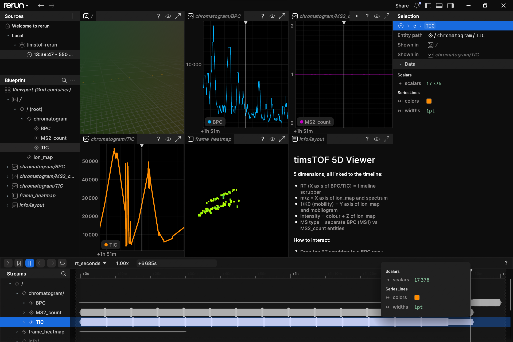

# timstof-rerun

**timsTOF 5D raw data viewer**



5D ion map in Rerun for https://ftp.pride.ebi.ac.uk/pride/data/archive/2024/06/PXD045439/230317_SIGRID_10_Slot1-41_1_4086.d.tar

```
RT         -> Rerun timeline  (drag scrubber to animate)
m/z        -> X axis of frame heatmap  (200-1700 Da)
1/K0       -> Y axis of frame heatmap  (0.60-1.80 Vs/cm²)
Intensity  -> pixel colour  (plasma LUT, log-scaled, black=0)
MS type    -> separate BPC/TIC entities
```


Reads Bruker timsTOF `.d` directories using
[rustdf](https://github.com/theGreatHerrLebert/rustims) (from the rustims framework,
[Teschner et al., J. Proteome Res. 2025](https://pubs.acs.org/doi/10.1021/acs.jproteome.4c00966))
and streams data directly to the [Rerun](https://rerun.io) viewer.

## What it does

| Subcommand | Output | Source |
|---|---|---|
| `rerun`  | Live 5D ion map + BPC/TIC in Rerun viewer | `analysis.tdf_bin` + `chromatography-data.sqlite` |
| `sql`    | Every `analysis.tdf` table as TSV | `analysis.tdf` (SQLite) |
| `chrom`  | All nanoElute + MS traces as TSV | `chromatography-data.sqlite` |
| `mgf`    | MS/MS spectra in MGF format | `analysis.tdf_bin` via rustdf |

## Why Rust + rustdf instead of Python + Bruker SDK

| | Bruker SDK (C++) | rustdf (Rust) |
|---|---|---|
| License | Proprietary, binary-only | MIT open source |
| Platform | Linux x86-64 only | All platforms |
| Calibration | SDK `tims_index_to_mz()` | SQLite polynomial (MzCalibration table) |
| Parallel reads | Single-threaded | rayon multi-threaded |
| Python needed | No | No |
| TSV intermediate files | 20 GB for 90-min run | Not needed (stream direct to Rerun) |

> **Note on calibration:** rustdf applies the polynomial coefficients from
> `MzCalibration` and `TimsCalibration` SQLite tables directly.
> For standard PROMEC ddaPASEF runs (no recalibration), this matches SDK output.
> If `getCalibrationId()` returns non-null (recalibrated data), the SDK
> recalibration state is not available without the SDK - mass accuracy may
> differ by <1 ppm.


## Installation

### Prerequisites

```bash
# Rust (stable)
curl --proto '=https' --tlsv1.2 -sSf https://sh.rustup.rs | sh

# Rerun viewer (for live mode)
pip install rerun-sdk          # or: cargo install rerun-cli
```

### Build

```bash
git clone https://github.com/animesh/timstof-rerun
cd timstof-rerun
cargo build --release
# Binary: ./target/release/timstof-rerun
```

### Quick Run on [230317_SIGRID_10_Slot1-41_1_4086.d](https://ftp.pride.ebi.ac.uk/pride/data/archive/2024/06/PXD045439/230317_SIGRID_10_Slot1-41_1_4086.d.tar)

```bash
wget https://ftp.pride.ebi.ac.uk/pride/data/archive/2024/06/PXD045439/230317_SIGRID_10_Slot1-41_1_4086.d.tar
tar xvf 230317_SIGRID_10_Slot1-41_1_4086.d.tar
```

```
.\target\release\timstof-rerun rerun 230317_SIGRID_10_Slot1-41_1_4086.d 
[2026-05-30T13:39:47Z INFO  timstof_rerun] Streaming to Rerun: 230317_SIGRID_10_Slot1-41_1_4086.d
[2026-05-30T13:39:47Z INFO  timstof_rerun::rerun_view] Spawning Rerun viewer
2026-05-30T13:39:48.707754Z  INFO re_perf_telemetry::telemetry: Telemetry initialized enabled=false service=rerun trace_mode="off" traces=off logs=off metrics=off tracy=false
Warning: Could not derive m/z calibration from SDK. Using simple boundary model which may have ~5 Da error on some datasets. This typically happens on macOS where Bruker SDK is not available.
[2026-05-30T13:39:48Z INFO  timstof_rerun::rerun_view] 66477 frames in 230317_SIGRID_10_Slot1-41_1_4086.d
[2026-05-30T13:39:49Z INFO  timstof_rerun::rerun_view]   chromatogram/BPC : 9970 points
[2026-05-30T13:39:49Z INFO  timstof_rerun::rerun_view]   chromatogram/TIC : 56500 points
[2026-05-30T13:39:49Z INFO  timstof_rerun::rerun_view]   MS2 markers: 56501 frames
2026-05-30T13:39:49.580982Z  WARN egui_wgpu::winit: Transparent window was requested, but the active wgpu surface does not support a `CompositeAlphaMode` with transparency.
2026-05-30T13:39:49.709446Z  INFO re_grpc_server: Listening for gRPC connections on 0.0.0.0:9876. Connect by running `rerun --connect rerun+http://127.0.0.1:9876/proxy`
[2026-05-30T13:41:51Z INFO  timstof_rerun::rerun_view] Streaming 2000 / 9976 MS1 frames  top_n=2000
[2026-05-30T13:41:55Z INFO  timstof_rerun::rerun_view]   200 frames...
[2026-05-30T13:42:00Z INFO  timstof_rerun::rerun_view]   400 frames...
[2026-05-30T13:42:05Z INFO  timstof_rerun::rerun_view]   600 frames...
[2026-05-30T13:42:11Z INFO  timstof_rerun::rerun_view]   800 frames...
[2026-05-30T13:42:18Z INFO  timstof_rerun::rerun_view]   1000 frames...
[2026-05-30T13:42:26Z INFO  timstof_rerun::rerun_view]   1200 frames...
[2026-05-30T13:42:33Z INFO  timstof_rerun::rerun_view]   1400 frames...
[2026-05-30T13:42:42Z INFO  timstof_rerun::rerun_view]   1600 frames...
[2026-05-30T13:42:51Z INFO  timstof_rerun::rerun_view]   1800 frames...
[2026-05-30T13:42:59Z INFO  timstof_rerun::rerun_view]   2000 frames...
[2026-05-30T13:42:59Z INFO  timstof_rerun::rerun_view] Done. 2000 frames.
[2026-05-30T13:42:59Z INFO  timstof_rerun::rerun_view] Viewer running - drag the RT scrubber to a BPC peak (30-60 min)
[2026-05-30T13:42:59Z INFO  timstof_rerun::rerun_view] The ion_map, frame_heatmap, mobilogram, spectrum all update automatically.
```

## General Usage

```bash
# Stream to live Rerun viewer (spawns viewer automatically)
timstof-rerun rerun 230317_SIGRID_10_Slot1-41_1_4086.d

# Limit frames for faster startup
timstof-rerun rerun run.d --max-frames 2000 --top-n 2000

# Save to .rrd file for later / sharing
timstof-rerun rerun run.d --save run.rrd
rerun run.rrd

# Connect to a running viewer
rerun --serve &
timstof-rerun rerun run.d --connect 127.0.0.1:9876
```

### Metadata and chromatography

```bash
# Dump all analysis.tdf tables as TSV (no binary read)
timstof-rerun sql run.d

# Dump all nanoElute + MS chromatography traces
timstof-rerun chrom run.d

# Write MGF for database search
timstof-rerun mgf run.d --out run.mgf
```

## Viewer controls

After running `rerun`:

1. **Drag the timeline scrubber** (bottom of screen) left toward the
   chromatographic peak region (typically 30-60 min for standard proteomics runs).
2. The **Frame Heatmap** updates at each RT position - you'll see peptide signal
   appear as coloured spots at characteristic m/z and 1/K0 positions.
3. The **BPC / TIC** panels show the full-run chromatogram - use them to find
   where signal peaks and navigate there.
4. **Mobilogram** and **Summed Spectrum** update with each frame.

## Architecture

```
src/
  main.rs       CLI (clap subcommands: rerun, sql, chrom, mgf)
  rerun_view.rs 5D streaming: rustdf frames -> Rerun Image + Scalar
  heatmap.rs    Plasma LUT, 2D binning, dilation kernel (pure Rust, no Python)
  chrom.rs      chromatography-data.sqlite blob decoder (f64 times, f32 intensities)
  sql_dump.rs   Dynamic analysis.tdf table dumper (sqlite_master introspection)
  mgf.rs        MGF writer via rustdf MS/MS spectra
```

## Dependencies

| Crate | Purpose |
|---|---|
| [rustdf](https://crates.io/crates/rustdf) | timsTOF TDF binary reader (from rustims) |
| [rerun](https://crates.io/crates/rerun) | Visualization SDK |
| [rusqlite](https://crates.io/crates/rusqlite) | SQLite (analysis.tdf, chromatography sqlite) |
| [rayon](https://crates.io/crates/rayon) | Parallel frame processing |
| [clap](https://crates.io/crates/clap) | CLI argument parsing |
| [anyhow](https://crates.io/crates/anyhow) | Error handling |

## Relationship to timsread

This project is a Rust rewrite of
[timsread](https://github.com/animesh/timsread) (C++ + Bruker SDK) and
[timsrerun.py](https://github.com/animesh/timsread/blob/main/timsrerun.py) (Python).

Compared to the original:

- No Bruker SDK dependency (timsread requires `timsdata.so`)
- No Python virtual environment (no `pip install rerun-sdk`)
- No 20 GB TSV intermediate files (direct streaming)
- Parallel frame reads via rayon
- Plasma LUT precomputed in Rust (no scipy dilation dependency)

## Citation

If you use this tool, please cite the underlying framework:

```bibtex
@article{teschner2025rustims,
  title   = {Rustims: An Open-Source Framework for Rapid Development and
             Processing of timsTOF Data-Dependent Acquisition Data},
  author  = {Teschner, David and Gomez-Zepeda, David and
             {\L}{\k{a}}cki, Mateusz K. and others},
  journal = {Journal of Proteome Research},
  volume  = {24},
  number  = {5},
  pages   = {2358--2368},
  year    = {2025},
  doi     = {10.1021/acs.jproteome.4c00966}
}
```

## License

MIT
